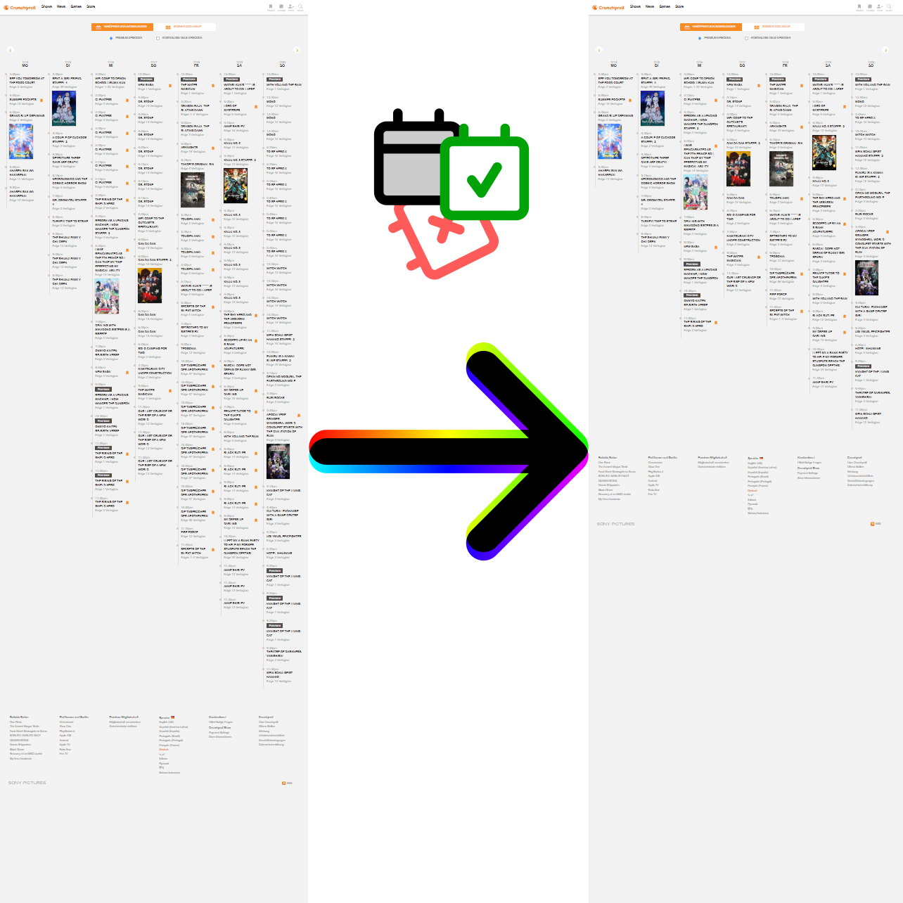
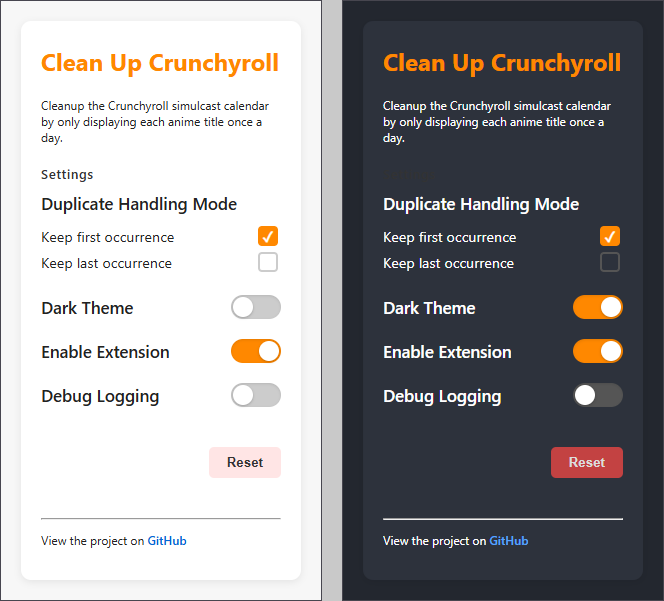

# Cleanup Crunchyroll simulcast calendar

Currently, anime titles are displayed twice or three times in the Crunchyroll simulcast calendar when they are released
in multiple languages. This extension cleans up the simulcast calendar and only displays the first entry for each anime
title per day.

## How to use the Extention

The extension is NOT available on the Chrome Web Store. However, you can load the extension locally.
(To create a Chrome Web Store-Developer Account, you have to pay 5 $ registration fee ... I'm not ready to do this right
now for a fun account.)

To load the extension locally:

1. Clone this repoitory.
2. In your browser, go to: `chrome://extensions/`
3. Toggle Developer mode on (top right of the page).
4. Click the Load unpacked button.
5. In the file dialog, select the cloned repository folder.

The Extension is Now Installed! :D
It will appear in your list of extensions and be active immediately.
Any changes you make to the source files can be refreshed by clicking the Reload icon next to the extension in the
Extensions page.

## Features

### Core Functionality

- **Automatic Duplicate Removal**: Scans and removes duplicate anime entries from the simulcast calendar
- **Smart Detection**: Identifies duplicates based on anime title names
- **Configurable Behavior**: Choose whether to keep first or last occurrence of duplicates

### User Interface

- **Settings Panel**: Click the extension icon to access configuration options
- **Dark/Light Theme**: Toggle between themes for the settings interface
- **Auto-save**: All changes are saved automatically without clicking save

## Settings

Click the extension icon in your browser toolbar to access settings. All changes are saved automatically.

### Duplicate Handling Mode

Controls which duplicate entries are removed when the same anime appears multiple times.

- **Keep first occurrence** (default): Removes all duplicates except the first one found
- **Keep last occurrence**: Removes all duplicates except the last one found

### Enable Extension

Master on/off switch for the entire extension functionality.

### Debug Logging

Shows detailed information in the browser console about what the extension is doing.

### Dark Theme

Changes the appearance of the settings popup interface.

### Default Settings

When you first install the extension or click "Reset":

- Duplicate Mode: Keep first occurrence
- Extension: Enabled
- Debug Logging: Disabled
- Theme: Dark

## Privacy & Security

### Data Collection

- **Zero data collection**: Extension doesn't collect any personal information
- **No external requests**: All processing happens locally in your browser
- **No tracking**: No analytics or usage tracking implemented

### Permissions Used

- **Storage**: Save your settings preferences locally
- **Scripting**: Run the cleanup script on Crunchyroll pages
- **Host permissions**: Only access Crunchyroll simulcast calendar pages

### Security Features

- **Minimal permissions**: Only requests necessary permissions
- **Local processing**: All duplicate detection happens in your browser
- **No data transmission**: Settings and data never leave your device

## Debugging

Enable "Debug Logging" in the settings to see detailed console output:

- Extension status and settings loading
- Per-day cleanup statistics
- Total duplicates removed
- Error messages and troubleshooting info

## Troubleshooting

### Extension Not Working?

1. **Check if you're on the right page**: Extension only works on Crunchyroll simulcast calendar pages
2. **Verify extension is enabled**: Check the "Enable Extension" toggle in settings
3. **Refresh the page**: Changes take effect after page reload
4. **Enable debug logging**: Turn on debug logging to see what's happening in the console

### No Duplicates Removed?

- The page might not have any duplicates (extension working correctly!)
- Check console with debug logging enabled for confirmation
- Ensure you're viewing the simulcast calendar, not other Crunchyroll pages

### Settings Not Saving?

- Settings save automatically - no save button needed
- If issues persist, try reloading the extension in `chrome://extensions`
- Check browser console for any error messages

## Requirements

- Manifest V3 support
- Chrome Extensions API
- Modern JavaScript support (ES6+)

Fully supported browsers:

- Google Chrome (latest)
- Microsoft Edge (Chromium-based)
- Brave Browser
- Opera (Chromium-based)

## Contributing

1. Fork the repository
2. Create your feature branch (`git checkout -b amazing-feature`)
3. Commit your changes (`git commit -m 'Add amazing feature'`)
4. Push to the branch (`git push origin feature/amazing-feature`)
5. Open a Pull Request, describing your changes and why they are needed

## License

This project is licensed under the MIT License - see the LICENSE file for details.

## Acknowledgments

- Built for the Crunchyroll community
- Inspired by the need for a cleaner anime viewing experience
